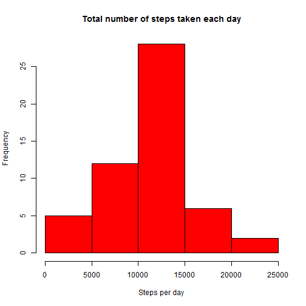

# Reproducible Research: Peer Assessment 1


## Loading and preprocessing the data


```r
filename <- "activity.zip"
unzip(filename)
filedata <- read.csv("activity.csv", na.strings = c("NA"))
```


## What is mean total number of steps taken per day?

```r
list1 <- split(filedata$steps, filedata$date)
totalsteps <- as.numeric(sapply(list1, sum))
hist(totalsteps, col = "red", main = "Total number of steps taken each day", 
    xlab = "Steps per day")
```

 

```r

stepsMean = mean(filedata$steps, na.rm = TRUE)
stepsMedian = median(filedata$steps, na.rm = TRUE)

stepsMean
```

```
## [1] 37.38
```

```r
stepsMedian
```

```
## [1] 0
```


## What is the average daily activity pattern?


## Imputing missing values


## Are there differences in activity patterns between weekdays and weekends?
